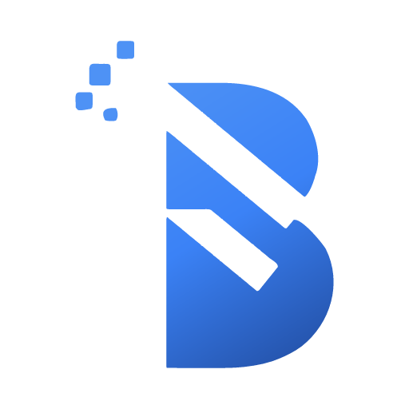
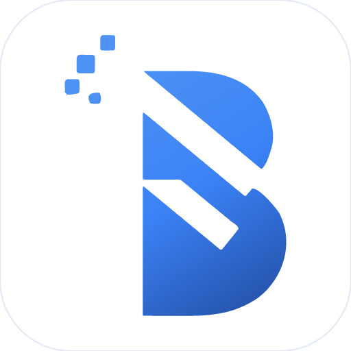
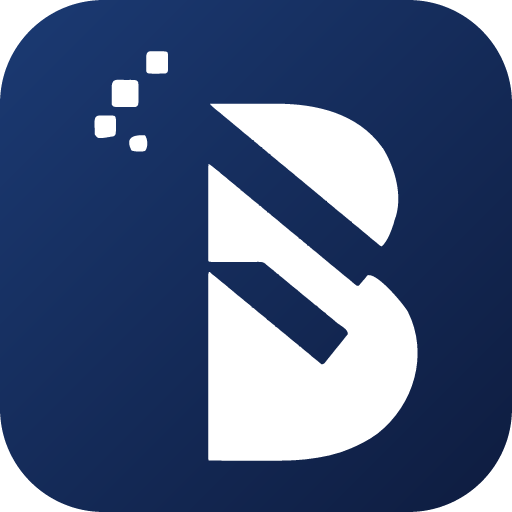
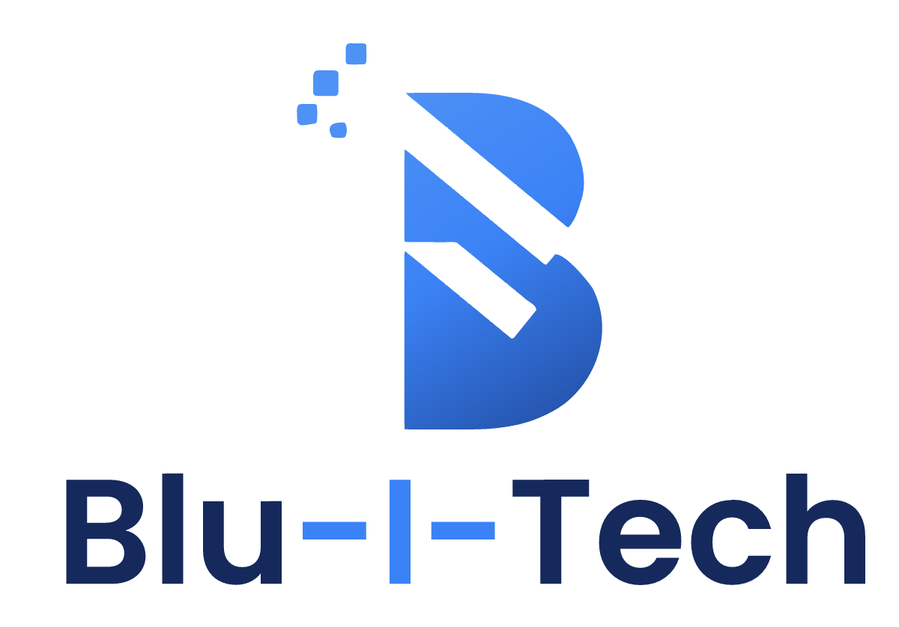

<h1 align="center">Blu-I-Tech — Brand Kit</h1>

<p align="center">
  <picture>
    <source media="(prefers-color-scheme: dark)" srcset="png/horizontal-tagline-white-1600.png">
    
  </picture>
</p>

<p align="center">
  Refined primary logo &nbsp;·&nbsp; lockups (with &amp; without tagline) &nbsp;·&nbsp; colour palette &nbsp;·&nbsp; design tokens
</p>

<br>

Refined from the primary `B` mark in `external-design/logo.png` — the original design was
**vector-traced (not redrawn)**, so the letterform, diagonal slices and pixel-dissolve are
preserved exactly, now as clean scalable SVG. PNG/ICO exports are generated from the masters.

## Logo

<table>
  <tr>
    <td align="center" width="220"></td>
    <td align="center" width="220"></td>
    <td align="center" width="220"></td>
    <td align="center" width="220">
      <picture>
        <source media="(prefers-color-scheme: dark)" srcset="png/stacked-white-1200.png">
        
      </picture>
    </td>
  </tr>
  <tr>
    <td align="center"><sub><b>Primary mark</b></sub></td>
    <td align="center"><sub><b>App icon · light</b></sub></td>
    <td align="center"><sub><b>App icon · dark</b></sub></td>
    <td align="center"><sub><b>Stacked lockup</b></sub></td>
  </tr>
</table>

> Full system (every variant + palette) → **[`brand-board.png`](brand-board.png)** · interactive sheet → **[`brand.html`](brand.html)**

## Logo files
| File | Use |
|------|-----|
| `horizontal-tagline.svg` | **Primary lockup with tagline** — mark + wordmark + “Technology. Built for business.” |
| `horizontal-tagline-white.svg` | Reversed lockup with tagline — for dark backgrounds |
| `horizontal.svg` | Horizontal lockup, no tagline — headers, sites, email signatures |
| `horizontal-white.svg` | Reversed horizontal lockup — for dark UI, navy, photos |
| `stacked-tagline.svg` | Stacked lockup with tagline — centred, full brand statement |
| `stacked-tagline-white.svg` | Reversed stacked lockup with tagline |
| `stacked.svg` | Stacked lockup, no tagline — avatars, cards, tight/centred spaces |
| `stacked-white.svg` | Reversed stacked lockup — for dark backgrounds |
| `logo-mark.svg` | Gradient mark on light backgrounds (icon master) |
| `logo-mark-white.svg` | Reversed — white mark for dark UI, navy, photos |
| `logo-mark-navy.svg` | One-colour navy — single-ink print, stamp, engraving |
| `icon-light.svg` | App / social icon — mark on white rounded tile |
| `icon-dark.svg` | App / social icon — mark on navy rounded tile |
| `favicon.svg` | Full mark reversed on a blue tile, tuned for small sizes |
| `favicon.ico` | Multi-size icon (16 / 32 / 48) |
| `png/` | Raster exports (transparent): lockups (±tagline) @1600/1200, marks @512–1024, icons @512/180, favicons @16–180, palette swatches |
| `brand.html` | Interactive brand sheet — variants, palette, usage, don'ts |
| `brand-board.png` | One-image overview of the system |

## Palette
| | Token | Hex | Role |
|---|-------|-----|------|
|  | Sky Blue | `#4E92F5` | gradient top, highlights, hover |
|  | **Brand Blue** | `#3B82F6` | **primary** — buttons, links, accents |
|  | Royal Blue | `#2F6BD6` | secondary blue, gradient mid |
|  | Deep Blue | `#2350A6` | text-safe blue (AAA on white), pressed, depth |
|  | Midnight Navy | `#16295C` | dark surfaces, headers, footers |
|  | Signal Cyan | `#38C6F4` | tech accent, focus rings, data-viz |
|  | Ink | `#0E1A33` | primary text |
|  | Slate | `#5B7189` | muted / secondary text |
|  | Mist | `#E3EAF6` | borders, dividers |
|  | Cloud | `#F5F8FD` | app / section background |
|  | Success | `#23B07D` | positive / confirm |
|  | Warning | `#F2A93B` | caution |
|  | Danger | `#E5544B` | error / destructive |

Gradient — `linear-gradient(160deg, #4E92F5, #3B82F6, #2350A6)`

> **Accessibility:** `#3B82F6` passes AA only at large / UI sizes on white. For body text
> on white use **Deep Blue** (`#2350A6`, 7.6:1) or Ink/Navy.

## Tokens for developers
- `palette.css` — CSS custom properties (`--bit-*`, functional `--color-*`, light + dark themes)
- `palette.json` — same values for design tools / build pipelines

```html
<link rel="stylesheet" href="palette.css">
<link rel="icon" type="image/svg+xml" href="favicon.svg">
<link rel="apple-touch-icon" href="png/icon-light-180.png">
```
```css
.btn-primary { background: var(--color-primary); color: var(--color-on-primary); }
a            { color: var(--color-primary-ink); }  /* AA on white */
.hero        { background: var(--bit-gradient-hero); }
```

## Notes
- The wordmark in the lockups is **Poppins SemiBold** converted to outlined vector paths
  (no live-font dependency), with the central “-I-” in Brand Blue. Poppins is SIL OFL —
  free for commercial use.
- SVGs are simplified & `svgo`-optimised (~2.5 KB each, down from ~20 KB) — the curve
  count is reduced and coordinates are trimmed to 1 decimal, with no visible change.
- PNGs/ICO are rendered from the SVGs with [`@resvg/resvg-js`]. Re-run your render
  script against the `*.svg` masters after any vector edit — never hand-edit the PNGs.
